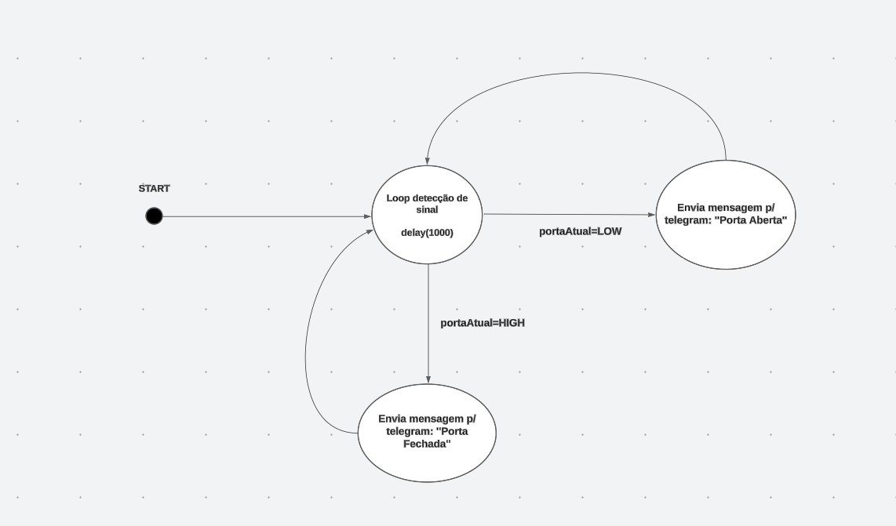

## **Alarme para Telegram com Esp32**

##### Esse projeto foi feito com o microcontrolador Esp32 utilizando a linguagem C++ no objetivo de ser um alarme com envios de mensagens para o Telegram.

----------------------------
- Clone do projeto
```
git clone https://github.com/marcojnr/alarme-telegram-esp32.git
```
- Codigo
[alarme_esp32.cpp](https://github.com/marcojnr/alarme-telegram-esp32/blob/main/alarme_esp32.cpp)

</br>

- Grafo

<p align="left">
    
</p>
